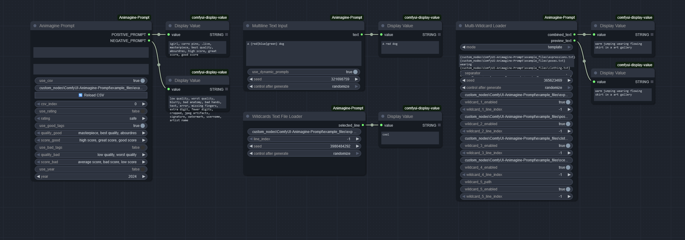

# ComfyUI Animagine Prompt Node

A ComfyUI node designed to help you structure your prompts following the recommended guidelines for the [Animagine-XL-4.0](https://huggingface.co/cagliostrolab/animagine-xl-4.0) model. This node makes it easy to maintain consistency in your prompts and experiment with different combinations of quality and style tags.



## Features

- **Smart Tag Management**: Easily add and combine quality tags, score tags, and other important modifiers
- **CSV Character Integration**: Load and use character descriptions from CSV files for consistent character generation
- **Flexible Controls**: Toggle different tag groups on/off as needed
- **Built-in Best Practices**: Incorporates recommended negative prompts and tag structures

## Installation

1. Navigate to your ComfyUI custom nodes directory
2. Clone this repository:
```bash
git clone https://github.com/yourusername/ComfyUI-Animagine-Prompt.git
```
3. Restart ComfyUI

## Using the Node

### Basic Usage

1. Add the "Animagine Prompt" node to your workflow
2. Enter your base prompt in the "positive_prompt" field
3. Toggle the desired tag groups (Good Tags, Bad Tags, etc.)
4. Connect the outputs to your text input nodes

### Tag Groups

The node provides several tag groups you can mix and match:

- **Good Tags**
  - Quality tags (masterpiece, best quality)
  - Score tags (high score, great score, good score)
- **Bad Tags**
  - Quality tags (low quality, worst quality)
  - Score tags (average score, bad score, low score)
- **Rating Tags**
  - Safe, Sensitive, NSFW, Explicit
- **Year Tag**
  - Specify a year to influence the style

### Using CSV Character Data

You can load character descriptions from a CSV file to maintain consistency in character generation:

1. Enable the CSV feature using the "use_csv" toggle
2. Provide the path to your CSV file
3. Select the character entry using the index selector

#### CSV File Structure

Your CSV file should have the following columns:
```
GENDER,CHARACTER,COPYRIGHT
1girl,character name,series name
1boy,another character,another series
```

See `create_your_own.txt` for detailed instructions on creating and editing CSV files.

## Tips and Best Practices

- Start with the basic tags enabled and gradually experiment with different combinations
- Keep your base prompts clean and focused - the node will handle the structural elements
- Use the CSV feature for characters you generate frequently to maintain consistency
- Monitor the logs for any issues with CSV loading or prompt generation

## Troubleshooting

### Common Issues

**CSV file not loading:**
- Check that the file path is correct
- Ensure the CSV has the required columns: GENDER, CHARACTER, COPYRIGHT
- Verify the file is saved in UTF-8 format

**Prompts not generating as expected:**
- Check that the appropriate tag groups are enabled
- Verify your base prompt doesn't contain conflicting tags
- Look for any trailing commas or spaces in your prompts

### Performance Notes

- Large CSV files may impact loading times
- The node includes a simple caching system for CSV data
- Consider splitting very large CSV files into smaller, focused collections

## Support

Found a bug or have a suggestion? Please open an issue on the GitHub repository.

## License

This project is licensed under the MIT License - see the LICENSE file for details.

## Acknowledgments

- Thanks to the Animagine-XL model creators for their guidelines
- Thanks to the ComfyUI community for their support and feedback